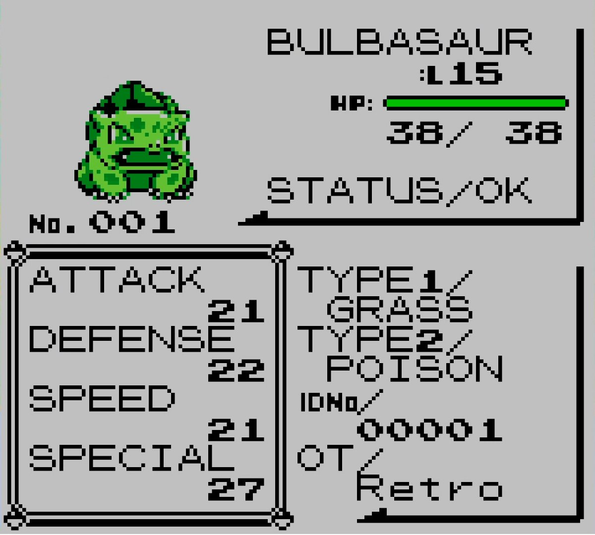

# React Props - Pokedex

Demo project showcasing React props using the Pokémon stats screens from Pokemon Yellow for the GameBoy Color.

This project recreates the Pokémon Yellow stats screen as faithfully as possible. The demo has two modes — **Pokedex** (view individual Pokémon cards and stats) and **Battle** (generate two teams and simulate a simple outcome) — which you can switch using the mode toggle. To compare layouts, use the top-right toggles: a grid overlay that shows a Pokecard-style cell grid, and a screenshot overlay that places the original screen behind the cards. Toggle either on or off to check alignment and sizing.



**How to run**

1. Clone the repo and enter the folder

```bash
git clone https://github.com/username/repo.git "React Props - Pokedex"
cd "React Props - Pokedex"
```

```bash
cd ~/Downloads/React\ Props\ -\ Pokedex
```

2. Start a local server

```bash
python3 -m http.server 8000
```

3. Open the demo in your browser

Go to: http://localhost:8000

Note: use the local server command above rather than opening `index.html` with `file://` so remote sprites load correctly.

Credits

- Original game: Pokémon (Red/Blue/Green/Yellow) — Game Freak / Nintendo. Concept: Satoshi Tajiri; art: Ken Sugimori.
- Fonts in `fonts/` are fan resources; credit original font authors listed in the font metadata.
- API / sprites: PokeAPI (https://pokeapi.co) and PokeAPI sprites (https://github.com/PokeAPI/sprites).

# React Props - Pokedex

Small demo project showcasing React props using a Pokédex-style UI.

## Quick Start (for complete beginners)

1. Get the files
   **Code → Download ZIP** on GitHub, unzip, then `cd` into the folder.

2. Run a local server (one command)

- Python 3:

```bash
python3 -m http.server 8000
```

3. Open the demo

- In your browser go to: `http://localhost:8000`

Tip: always use a local server rather than opening `index.html` with `file://` so remote sprite images load correctly.

## Included Pokémon

- All 151 Generation I Pokémon (Bulbasaur #001 through Mew #151) are defined in `components/Pokedex.js`.

## Credits

- Original game: Pokémon (Red / Blue / Green / Yellow era) — developed by Game Freak and published by Nintendo. Original concept by Satoshi Tajiri; character art by Ken Sugimori.
- Fonts included (fan resources): `Pokemon Classic.ttf`, `pokemon-red-blue-green-yellow-edition-font.otf`, and `pokemon-red-blue-green-yellow-edition-font.ttf` in the `fonts/` directory. These are not official Nintendo fonts — credit any original fan author listed in the font metadata; contact the repo owner to add an explicit attribution if you are the font author.

- API / data sources: this demo specifically uses resources from PokeAPI and its sprites repository:
  - PokeAPI: https://pokeapi.co — used to fetch the list of Generation I Pokémon in `components/Pokegame.js` (example request: `https://pokeapi.co/api/v2/pokemon?limit=151`). Please follow PokeAPI's terms and attribution guidance: https://pokeapi.co/docs/v2
  - PokeAPI Sprites (GitHub): https://github.com/PokeAPI/sprites — Generation I (Yellow) sprite images are referenced directly via raw URLs hosted on GitHub (example: `https://raw.githubusercontent.com/PokeAPI/sprites/master/sprites/pokemon/versions/generation-i/yellow/<id>.png`). Credit the PokeAPI sprites maintainers and follow the sprite repo license if you reuse the images.

If you are the author of any asset included here (font, sprite, or other), and you prefer a different credit line or removal, please open an issue or submit a PR.

```

```
